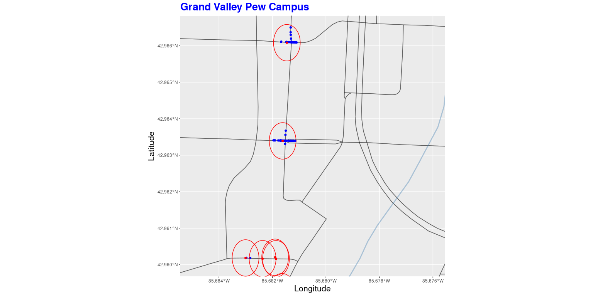

Train Accident Findings Report
================
Luke Cadagin
11/24/2021

# Report of Grand Rapids Train Accident Analysis

## Set Up

Load necessary packages and set max numerical digits displayed in tibble
to 8 (necessary for long/lat coordinates):

``` r
library(tidyverse)
library(sf)
library(osmdata)
library(ggpubr)
library(ggforce)
options(digits = 8)
```

Specify size of all graphs in Knitted Documents:

``` r
knitr::opts_chunk$set(echo = TRUE, fig.width = 16, fig.height = 8)
```

Upload Grand Rapids Crash Dataset (2008 - 2017):

``` r
crash_data <- read_csv(here::here("data", "CGR_Crash_Data.csv"))
head(crash_data[1:6])
```

    ## # A tibble: 6 x 6
    ##       X     Y OBJECTID ROADSOFTID BIKE  CITY        
    ##   <dbl> <dbl>    <dbl>      <dbl> <chr> <chr>       
    ## 1 -85.7  42.9        1    2589528 No    Grand Rapids
    ## 2 -85.6  42.9        2    2593183 No    Grand Rapids
    ## 3 -85.7  43.0        3    2582102 No    Grand Rapids
    ## 4 -85.6  42.9        4    2579820 No    Grand Rapids
    ## 5 -85.7  43.0        5    2594624 No    Grand Rapids
    ## 6 -85.7  43.0        6    2599372 No    Grand Rapids

Configure features necessary for Grand Rapids map (using openstreetmap
api)

``` r
location_gr <- getbb("Grand Rapids") %>% 
    opq()

major_roads_gr <- location_gr %>%
    add_osm_feature(key = "highway", value = c("motorway", "trunk", "primary", "secondary", "tertiary")) %>% 
    osmdata_sf()

#minor_roads_gr <- location_gr %>%
    #add_osm_feature(key = "highway", value = c("unclassified", "residential")) %>%
    #osmdata_sf()

water_gr <- location_gr %>% 
    add_osm_feature(key = "waterway", value = c("river")) %>% 
    osmdata_sf()

boundary_gr <- location_gr %>% 
    add_osm_feature(key = "boundary", value = "administrative") %>%
    add_osm_feature(key = "name", value = "Grand Rapids") %>% 
    osmdata_sf()
```

## Initial Exploration of Direct Train Accidents

I am interested in studying the impact gates at a railroad crossing have
on the number of accidents associated with trains.

Let’s start by visualizing the number of Grand Rapids crashes associated
with a train from 2008 - 2017.

``` r
crash_data_train <- crash_data %>% 
  filter(TRAIN == "Yes")

crash_data_train %>% 
  select(`Longitude` = X, `Latitude` = Y, CRASHDATE, TRAIN, `Principal Road` = PRNAME, NUMOFINJ)
```

    ## # A tibble: 3 x 6
    ##   Longitude Latitude CRASHDATE  TRAIN `Principal Road` NUMOFINJ
    ##       <dbl>    <dbl> <date>     <chr> <chr>               <dbl>
    ## 1     -85.6     42.9 2008-02-19 Yes   BURTON                  1
    ## 2     -85.7     43.0 2014-05-03 Yes   11TH                    1
    ## 3     -85.7     43.0 2017-12-27 Yes   CENTURY                 0

``` r
  ggplot()+
            geom_sf(data = major_roads_gr$osm_lines, size = .6, alpha = .6, color = 'black') +
            #geom_sf(data = minor_roads_gr$osm_lines, size = .3, alpha = .3, color = 'black') +
            geom_sf(data = water_gr$osm_lines, size = 1, alpha = .4, color = 'steelblue') +
            geom_sf(data = boundary_gr$osm_lines, size = 1, alpha = .6, color = "orange") +
            geom_point(data = crash_data_train, mapping = aes(x = X, y = Y), color = "blue") +
            coord_sf(xlim = c(-85.57, -85.75), ylim = c(42.88, 43.03)) +
            labs(title = "Grand Rapids City Limits", x = "Longitude", y = "Latitude") +
            font("title", size = 20, color = "blue", face = "bold") +
            font("x", size = 16) +
            font("y", size = 16)
```

<!-- -->

As you can see, from 2008 to 2017 there were only three accidents that
occurred in Grand Rapids involving a train (In 2017, 2014, and 2008).

## Pulling In Grand Rapids Train Crossings:

Although we have a very limited number of accidents directly involving a
train, this is not a dead-end for our analysis.

Next let’s upload a a dataset from Transportation.gov
(<https://data.transportation.gov/Railroads/Crossing-Inventory-Data-Current/m2f8-22s6>)
that provides information about every railroad crossing in the USA:

``` r
rr_crossing_data <- read_csv(here::here("data", "Crossing_Inventory_Data_-_Current.csv"))

head(rr_crossing_data[1:6])
```

    ## # A tibble: 6 x 6
    ##   `Revision Date` `Reporting Agency Type I… `Reporting Agency Typ… `Reason Code`
    ##   <date>                              <dbl> <chr>                          <dbl>
    ## 1 1970-01-01                              1 Railroad                          15
    ## 2 1970-01-01                              1 Railroad                          15
    ## 3 1970-01-01                              1 Railroad                          15
    ## 4 1970-01-01                              1 Railroad                          15
    ## 5 1970-01-01                              1 Railroad                          15
    ## 6 1970-01-01                              1 Railroad                          15
    ## # … with 2 more variables: Reason Description <chr>, Crossing ID <chr>

Now we filter this data for only railroad crossings within the Grand
Rapids city limits (Note that there are three crossing located in the
city center where Latitude = 42.96336 that I removed as it seems like
the long/lang for these were placeholders):

``` r
rr_crossing_data_gr <- rr_crossing_data %>% 
  filter(`State Name` == "MICHIGAN", `City Name` == "GRAND RAPIDS", `Intersecting Roadway` == "Yes", Latitude < 43, Latitude != 42.96336)

head(rr_crossing_data_gr[1:6])
```

    ## # A tibble: 6 x 6
    ##   `Revision Date` `Reporting Agency Type I… `Reporting Agency Typ… `Reason Code`
    ##   <date>                              <dbl> <chr>                          <dbl>
    ## 1 1991-04-03                              1 Railroad                          16
    ## 2 1997-12-31                              1 Railroad                          16
    ## 3 2001-08-31                              1 Railroad                          16
    ## 4 2010-01-01                              2 State                             16
    ## 5 2010-01-01                              2 State                             16
    ## 6 2010-09-01                              1 Railroad                          16
    ## # … with 2 more variables: Reason Description <chr>, Crossing ID <chr>

Let’s Make Sure that there are no duplicates in the data:

``` r
nrow(distinct(rr_crossing_data_gr, Latitude))
```

    ## [1] 74

``` r
nrow(rr_crossing_data_gr)
```

    ## [1] 74

We can visualize this data in red on our Grand Rapid’s Map:

``` r
  ggplot()+
            geom_sf(data = major_roads_gr$osm_lines, size = .6, alpha = .6, color = 'black') +
            #geom_sf(data = minor_roads_gr$osm_lines, size = .3, alpha = .3, color = 'black') +
            geom_sf(data = water_gr$osm_lines, size = 1, alpha = .4, color = 'steelblue') +
            geom_sf(data = boundary_gr$osm_lines, size = 1, alpha = .6, color = "orange") +
            geom_point(data = rr_crossing_data_gr, mapping = aes(x = Longitude, y = Latitude), color = "red") +
            coord_sf(xlim = c(-85.57, -85.75), ylim = c(42.88, 43.03)) +
            labs(title = "Grand Rapids City Limits", x = "Longitude", y = "Latitude") +
            font("title", size = 20, color = "blue", face = "bold") +
            font("x", size = 16) +
            font("y", size = 16)
```

<!-- -->

## Exploring Accidents in the Vacinity of Railroad Crossings:

We now would like to know how many crashes fall within a .0005
(longitudinal units) radius of each railroad crossing.

To do so, we first write a function called in\_radius() that detects if
a longitude/latitude coordinate is located within a .0005 radius of a
given anchor coordinate:

``` r
in_radius <- function(x1, y1, x2, y2) {
  if_else(((x1 - x2) ^ 2 + (y1 - y2) ^ 2) <= .0005 ^ 2, 1, 0)
}
```

Next we create a new accident subset named near\_rr\_crash that only
contains crashes that occurred within a .0005 radius of a railroad
crossing:

``` r
near_rr_crash <- crash_data %>% 
  rowwise() %>% 
  filter(1 %in% in_radius(X, Y, rr_crossing_data_gr$Longitude, rr_crossing_data_gr$Latitude))

head(near_rr_crash[1:6])
```

    ## # A tibble: 6 x 6
    ## # Rowwise: 
    ##       X     Y OBJECTID ROADSOFTID BIKE  CITY        
    ##   <dbl> <dbl>    <dbl>      <dbl> <chr> <chr>       
    ## 1 -85.6  42.9      120    2587376 No    Grand Rapids
    ## 2 -85.7  43.0      343    2579633 No    Grand Rapids
    ## 3 -85.6  42.9      663    2591863 No    Grand Rapids
    ## 4 -85.6  42.9      664    2597546 No    Grand Rapids
    ## 5 -85.6  42.9      665    2583626 No    Grand Rapids
    ## 6 -85.6  42.9      666    2579464 No    Grand Rapids

We plot this data on our grand rapids map to visualize the result:

``` r
  ggplot()+
            geom_sf(data = major_roads_gr$osm_lines, size = .6, alpha = .6, color = 'black') +
            #geom_sf(data = minor_roads_gr$osm_lines, size = .3, alpha = .3, color = 'black') +
            geom_sf(data = water_gr$osm_lines, size = 1, alpha = .4, color = 'steelblue') +
            geom_sf(data = boundary_gr$osm_lines, size = 1, alpha = .6, color = "orange") +
            geom_point(data = near_rr_crash, mapping = aes(x = X, y = Y), color = "blue") +
            geom_point(data = rr_crossing_data_gr, mapping = aes(x = Longitude, y = Latitude), color = "red") +
            geom_circle(data = rr_crossing_data_gr, mapping = aes(x0 = Longitude, y0 = Latitude, r = .0005), color = "red") +
            coord_sf(xlim = c(-85.57, -85.75), ylim = c(42.88, 43.03)) +
            labs(title = "Grand Rapids City Limits", x = "Longitude", y = "Latitude") +
            font("title", size = 20, color = "blue", face = "bold") +
            font("x", size = 16) +
            font("y", size = 16)
```

<!-- -->

Below is a zoomed-in portion of the map for better detail (located
around the GVSU Pew Campus):

``` r
  ggplot()+
            geom_sf(data = major_roads_gr$osm_lines, size = .6, alpha = .6, color = 'black') +
            #geom_sf(data = minor_roads_gr$osm_lines, size = .3, alpha = .3, color = 'black') +
            geom_sf(data = water_gr$osm_lines, size = 1, alpha = .4, color = 'steelblue') +
            geom_sf(data = boundary_gr$osm_lines, size = 1, alpha = .6, color = "orange") +
            geom_point(data = near_rr_crash, mapping = aes(x = X, y = Y), color = "blue") +
            geom_point(data = rr_crossing_data_gr, mapping = aes(x = Longitude, y = Latitude), color = "red") +
            geom_circle(data = rr_crossing_data_gr, mapping = aes(x0 = Longitude, y0 = Latitude, r = .0005), color = "red") +
            coord_sf(xlim = c(-85.676, -85.685), ylim = c(42.96, 42.9665)) +
            labs(title = "Grand Valley Pew Campus", x = "Longitude", y = "Latitude") +
            font("title", size = 20, color = "blue", face = "bold") +
            font("x", size = 16) +
            font("y", size = 16)
```

<!-- -->

## Summarizing the Results

Now we create a tibble that sums the number of crashes that fall within
a .0005 radius of each crossing along with the number of Gate arms at
that crossing and the total number of trains that pass through during
the day and night:

``` r
exposure <- rr_crossing_data_gr %>% 
  rowwise() %>% 
  mutate(Radius_Count = sum(in_radius(Longitude, Latitude, near_rr_crash$X, near_rr_crash$Y))) %>% 
  select(Longitude, Latitude, Street, "Gate_Arm_N" = `Count Roadway Gate Arms`, Radius_Count, "Day_Trains_N" = `Total Daylight Thru Trains`, "Night_Trains_N" = `Total Nighttime Thru Trains`) %>% 
  arrange(desc(Radius_Count)) %>% 
  ungroup()

head(exposure,10)
```

    ## # A tibble: 10 x 7
    ##    Longitude Latitude Street Gate_Arm_N Radius_Count Day_Trains_N Night_Trains_N
    ##        <dbl>    <dbl> <chr>       <dbl>        <dbl>        <dbl>          <dbl>
    ##  1     -85.7     43.0 PLAIN…          0          111            0              0
    ##  2     -85.7     43.0 LEONA…          0          108            0              0
    ##  3     -85.7     43.0 W LEO…          0           84            0              2
    ##  4     -85.7     42.9 HALL …          2           79            2              2
    ##  5     -85.6     43.0 E BEL…          0           74            1              0
    ##  6     -85.7     43.0 FULTO…          0           45            1              2
    ##  7     -85.7     43.0 ALPIN…          0           41            1              0
    ##  8     -85.7     43.0 LAKE …          2           40            1              2
    ##  9     -85.7     43.0 11TH …          0           38            0              2
    ## 10     -85.7     42.9 JEFFE…          2           32            2              2

We can use the number of accidents that occur within .0005 longitudinal
units from a crossing (Radius\_Count) to represent traffic exposure. We
are deriving latent information from this variable to determine if
additional safety protocols should be put in place at any particular
train crossing.

The tibble is sorted from largest Radius\_Counts to smallest.

Note that among all 74 railroad crossings in Grand Rapids, 26 have at
least one gate arm.

``` r
exposure %>% 
  filter(Gate_Arm_N > 0) %>% 
  nrow()
```

    ## [1] 26

Of these 26 crossings, 22 have at least one Daylight Train OR one
Nighttime train pass through. This is about 85% (22/26):

``` r
exposure %>% 
  filter(Gate_Arm_N > 0, (Day_Trains_N > 0 | Night_Trains_N > 0)) %>% 
  nrow()
```

    ## [1] 22

Thus, it would make sense that the criteria for adding a gate arm to a
crossing or adding additional safety protocols would include a
requirement for at least one Daylight Train or Nighttime train at that
crossing.

## Analyzing What Crossings Should Be Scrutinized:

Let’s take a look at the top 10 traffic exposure crossings on the Grand
Rapids Map:

``` r
exposure_top_10 <- exposure %>% 
  slice_head(n = 10)
```

``` r
  ggplot()+
            geom_sf(data = major_roads_gr$osm_lines, size = .6, alpha = .6, color = 'black') +
            #geom_sf(data = minor_roads_gr$osm_lines, size = .3, alpha = .3, color = 'black') +
            geom_sf(data = water_gr$osm_lines, size = 1, alpha = .4, color = 'steelblue') +
            geom_sf(data = boundary_gr$osm_lines, size = 1, alpha = .6, color = "orange") +
            geom_point(data = exposure_top_10, mapping = aes(x = Longitude, y = Latitude), color = "red") +
            coord_sf(xlim = c(-85.57, -85.75), ylim = c(42.88, 43.03)) +
            labs(title = "Grand Rapids City Limits", x = "Longitude", y = "Latitude") +
            font("title", size = 20, color = "blue", face = "bold") +
            font("x", size = 16) +
            font("y", size = 16)
```

<!-- -->

We can see these crossings are scattered around the city. Notice that
two of these crossings are located on the GVSU Pew Campus:

``` r
  ggplot()+
            geom_sf(data = major_roads_gr$osm_lines, size = .6, alpha = .6, color = 'black') +
            #geom_sf(data = minor_roads_gr$osm_lines, size = .3, alpha = .3, color = 'black') +
            geom_sf(data = water_gr$osm_lines, size = 1, alpha = .4, color = 'steelblue') +
            geom_sf(data = boundary_gr$osm_lines, size = 1, alpha = .6, color = "orange") +
            geom_point(data = exposure_top_10, mapping = aes(x = Longitude, y = Latitude), color = "red") +
            coord_sf(xlim = c(-85.676, -85.685), ylim = c(42.96, 42.9665)) +
            labs(title = "Grand Valley Pew Campus", x = "Longitude", y = "Latitude") +
            geom_text(data = exposure_top_10, mapping = aes(Longitude, Latitude, label = Street), nudge_y = -.0002, color = "red") +
            font("title", size = 20, color = "blue", face = "bold") +
            font("x", size = 16) +
            font("y", size = 16)
```

<!-- -->

We see that the crossing at “LAKE MICHIGAN DRIVE NW”
(-85.681461,42966083) does have gate arms while the crossing at “FULTON
STREET” (-85.681619,42.963392 ) does not have gate arms. Also note that
the total Daylight (1) and Nighttime (2) trains for these crossings are
the same while the Radius\_Count for the “FULTON STREET” crossing (45)
is greater than the “LAKE MICHIGAN DRIVE NW” crossing (40):

``` r
exposure_top_10 %>% 
  filter(Street %in% c("LAKE MICHIGAN DRIVE NW", "FULTON STREET"))
```

    ## # A tibble: 2 x 7
    ##   Longitude Latitude Street  Gate_Arm_N Radius_Count Day_Trains_N Night_Trains_N
    ##       <dbl>    <dbl> <chr>        <dbl>        <dbl>        <dbl>          <dbl>
    ## 1     -85.7     43.0 FULTON…          0           45            1              2
    ## 2     -85.7     43.0 LAKE M…          2           40            1              2

The placement of crossing gate arms in Grand Rapids seems to be a bit
inconsistent and worthy of a second look.

Note that out of the top 10 crossings with the highest traffic exposure,
7 do not have Gate Arms:

``` r
exposure_top_10 %>% 
  filter(Gate_Arm_N == 0)
```

    ## # A tibble: 7 x 7
    ##   Longitude Latitude Street  Gate_Arm_N Radius_Count Day_Trains_N Night_Trains_N
    ##       <dbl>    <dbl> <chr>        <dbl>        <dbl>        <dbl>          <dbl>
    ## 1     -85.7     43.0 PLAINF…          0          111            0              0
    ## 2     -85.7     43.0 LEONAR…          0          108            0              0
    ## 3     -85.7     43.0 W LEON…          0           84            0              2
    ## 4     -85.6     43.0 E BELT…          0           74            1              0
    ## 5     -85.7     43.0 FULTON…          0           45            1              2
    ## 6     -85.7     43.0 ALPINE…          0           41            1              0
    ## 7     -85.7     43.0 11TH S…          0           38            0              2

Of these 7, 5 have at least one daylight OR nighttime train go through
each day (as noted earlier, this seems to be important criteria for
adding a gate arm):

``` r
crossings_of_interest <- exposure_top_10 %>% 
  filter(Gate_Arm_N == 0, (Day_Trains_N > 0 | Night_Trains_N > 0))

crossings_of_interest
```

    ## # A tibble: 5 x 7
    ##   Longitude Latitude Street  Gate_Arm_N Radius_Count Day_Trains_N Night_Trains_N
    ##       <dbl>    <dbl> <chr>        <dbl>        <dbl>        <dbl>          <dbl>
    ## 1     -85.7     43.0 W LEON…          0           84            0              2
    ## 2     -85.6     43.0 E BELT…          0           74            1              0
    ## 3     -85.7     43.0 FULTON…          0           45            1              2
    ## 4     -85.7     43.0 ALPINE…          0           41            1              0
    ## 5     -85.7     43.0 11TH S…          0           38            0              2

I would recommend that the city of Grand Rapids takes a second look at
these crossings to determine if a gate arm or additional traffic
precautions are necessary.

It is also worth noting that one of the three accidents we found that
directly involved a train was located at the 11TH STREET crossing
included in the crossings of interest above:

``` r
crash_data_train %>% 
  rowwise() %>% 
  filter(1 %in% in_radius(X, Y, crossings_of_interest$Longitude, crossings_of_interest$Latitude)) %>% 
  select(`Longitude` = X, `Latitude` = Y, CRASHDATE, TRAIN, `Principal Road` = PRNAME, NUMOFINJ)
```

    ## # A tibble: 1 x 6
    ## # Rowwise: 
    ##   Longitude Latitude CRASHDATE  TRAIN `Principal Road` NUMOFINJ
    ##       <dbl>    <dbl> <date>     <chr> <chr>               <dbl>
    ## 1     -85.7     43.0 2014-05-03 Yes   11TH                    1

``` r
ggplot()+
            geom_sf(data = major_roads_gr$osm_lines, size = .6, alpha = .6, color = 'black') +
            #geom_sf(data = minor_roads_gr$osm_lines, size = .3, alpha = .3, color = 'black') +
            geom_sf(data = water_gr$osm_lines, size = 1, alpha = .4, color = 'steelblue') +
            geom_sf(data = boundary_gr$osm_lines, size = 1, alpha = .6, color = "orange") +
            geom_point(data = crash_data_train, mapping = aes(x = X, y = Y), color = "blue") +
            geom_point(data = crossings_of_interest, mapping = aes(x = Longitude, y = Latitude), color = "red") +
            geom_text(data = exposure_top_10, mapping = aes(Longitude, Latitude, label = Street), nudge_y = -.0002, color = "red") +
            coord_sf(xlim = c(-85.68, -85.686), ylim = c(42.98, 42.983)) +
            labs(title = "11th Street Crossing", x = "Longitude", y = "Latitude") +
            font("title", size = 20, color = "blue", face = "bold") +
            font("x", size = 16) +
            font("y", size = 16)
```

<!-- -->

# Exploratory Application

To supplement this analysis, I have put together a Shiny Application for
the city of Grand Rapids to explore the crash dataset on their own. This
application can be accessed using the address below:

<https://lcadagin.shinyapps.io/interactive_crash_plotting/>
